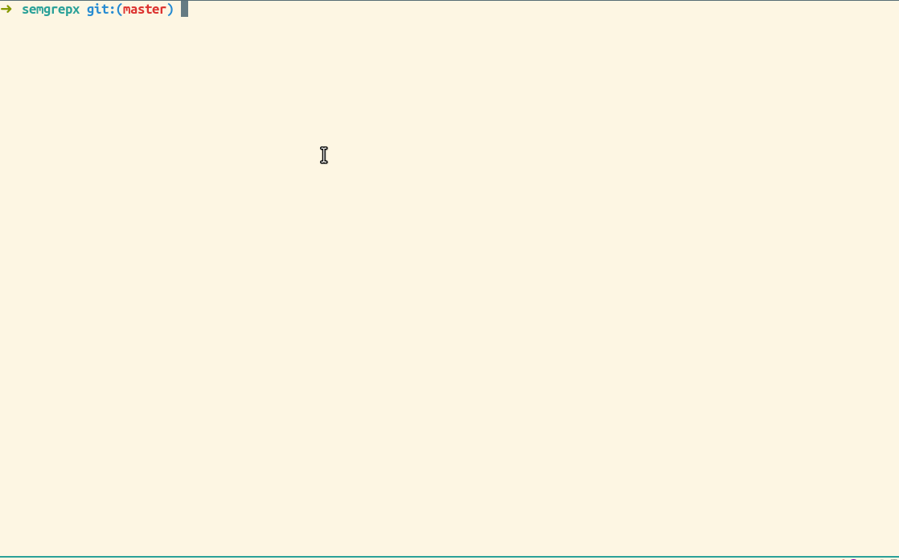

# SEMGREPX

> A tool for rewriting semgrep matches using externals tools

### Installation:

If you have a Go toolchain installed, you can install the `semgrepx` binary like this:

```sh
go install github.com/icholy/semgrepx@latest
```

It will be placed in your `GOBIN` directory, which defaults to `~/go/bin`.
Depending on your install method, this may or may not already be in your `PATH`.


### CLI:

```
Usage: semgrepx [flags] <command> [args...]
flags:
  -dir string
    	directory to run in (default ".")
  -file string
    	semgrep json file
  -lines
    	expand matches to full lines
  -retry int
    	number of retries (< 0 is unlimited)
  -trim
    	trim whitespace
```

### How it works:

The provided command is executed for every semgrep match.
The matched code is sent to the command's stdin.
The matched code is replaced by the command's stdout.

### Example:

```sh
# create a file of matches
semgrep -l go --pattern 'log.$A(...)' --json > matches.json

# rewrite all the matches using the llm tool
semgrepx llm 'update this go to use log.Printf' < matches.json
```

* This example uses the [llm](https://llm.datasette.io/en/stable/) tool.

### Demo:


